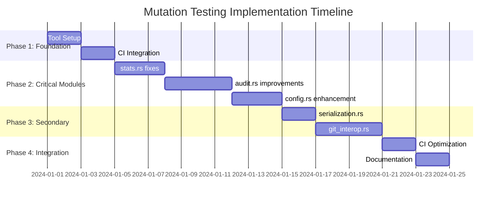

# Mutation Testing Implementation Plan for git-perf

## Overview
This document provides a concrete, step-by-step implementation plan to improve mutation testing coverage for the git-perf project. The plan is divided into actionable phases with specific deliverables and success criteria.

## Current State Assessment
- **Total LOC:** 4,591 lines of Rust code
- **Current Tests:** 47 unit tests + 30 bash integration tests
- **Estimated Mutation Score:** 65-75%
- **Target Mutation Score:** 80%+ overall, 90%+ for critical modules

## Phase 1: Foundation Setup (Week 1)

### Task 1.1: Install and Configure cargo-mutants
**Priority:** High | **Effort:** 2 hours | **Owner:** Dev Team

**Acceptance Criteria:**
- [ ] cargo-mutants installed and verified working
- [ ] Initial baseline mutation testing report generated
- [ ] Configuration file created with appropriate timeouts and exclusions

**Implementation Steps:**
```bash
# Install tool
cargo install cargo-mutants

# Create configuration
echo '[package.metadata.mutants]
skip = ["tests", "examples", "benches"]
timeout = 60
jobs = 4' >> Cargo.toml

# Generate baseline report
cargo mutants --output baseline-report.json
```

**Deliverables:**
- Baseline mutation testing report
- Documentation of current mutation scores per module
- CI/CD integration plan

### Task 1.2: Establish Mutation Testing Infrastructure
**Priority:** High | **Effort:** 4 hours | **Owner:** DevOps/Lead Dev

**Acceptance Criteria:**
- [ ] GitHub Actions workflow created for mutation testing
- [ ] Mutation testing report storage configured
- [ ] PR checks configured for critical modules

**Implementation Steps:**
1. Create `.github/workflows/mutation-testing.yml`
2. Configure artifact storage for mutation reports
3. Set up PR status checks for mutation score regressions

**Deliverables:**
- CI/CD workflow file
- Mutation testing job configuration
- PR protection rules documentation

## Phase 2: Critical Module Improvements (Week 2-3)

### Task 2.1: Fix Error Handling Coverage in stats.rs
**Priority:** Critical | **Effort:** 6 hours | **Owner:** Stats Module Owner

**Current Issues:**
- 2 `unwrap()` calls at lines 88 and 156
- Missing tests for NaN/infinity handling
- No tests for empty collection edge cases

**Acceptance Criteria:**
- [ ] All `unwrap()` calls replaced with proper error handling
- [ ] Tests added for all error conditions
- [ ] Mutation score for stats.rs reaches 90%+

**Implementation Steps:**
1. **Replace unwrap() calls:**
   ```rust
   // Replace: measurements_copy.median().unwrap()
   // With: measurements_copy.median().ok_or(anyhow!("Cannot calculate median of empty measurements"))?
   ```

2. **Add comprehensive edge case tests:**
   - Empty collections
   - Single element collections
   - Collections with NaN/infinity values
   - Zero standard deviation scenarios

3. **Test boundary conditions:**
   - Very large numbers (overflow scenarios)
   - Very small numbers (underflow scenarios)
   - Precision edge cases

**Files to Modify:**
- `git_perf/src/stats.rs` (lines 88, 156)
- Add new test cases in existing test module

**Mutation Testing Focus:**
- Arithmetic operator mutations (`+`, `-`, `*`, `/`)
- Comparison operator mutations (`>`, `<`, `>=`, `<=`, `==`, `!=`)
- Return value mutations
- Conditional branch mutations

### Task 2.2: Enhance audit.rs Conditional Logic Testing
**Priority:** Critical | **Effort:** 8 hours | **Owner:** Audit Module Owner

**Current Issues:**
- 21 conditional branches with incomplete testing
- `unwrap()` call at line 28 in `get_direction_arrow`
- Missing edge cases for relative deviation calculations

**Acceptance Criteria:**
- [ ] All conditional branches have explicit test coverage
- [ ] Error handling improved for comparison operations
- [ ] Mutation score for audit.rs reaches 85%+

**Implementation Steps:**
1. **Fix critical unwrap():**
   ```rust
   // Replace: head_mean.partial_cmp(&tail_mean).unwrap()
   // With proper NaN handling
   match head_mean.partial_cmp(&tail_mean) {
       Some(ordering) => match ordering { ... },
       None => return "?" // or appropriate error handling
   }
   ```

2. **Add boundary condition tests:**
   - Equal head and tail means
   - NaN values in measurements
   - Infinity values in calculations
   - Zero measurements scenarios

3. **Test all conditional paths:**
   - All combinations of min/max relative deviation checks
   - Different dispersion method code paths
   - Error propagation scenarios

**Files to Modify:**
- `git_perf/src/audit.rs` (lines 28, and conditional logic sections)
- Expand existing test module with edge cases

### Task 2.3: Strengthen config.rs Error Path Coverage
**Priority:** High | **Effort:** 6 hours | **Owner:** Config Module Owner

**Current Issues:**
- Multiple `unwrap()` calls in test code and file operations
- Insufficient testing of malformed configuration files
- Missing tests for file system error conditions

**Acceptance Criteria:**
- [ ] All file operation error scenarios tested
- [ ] Configuration parsing error handling improved
- [ ] Mutation score for config.rs reaches 80%+

**Implementation Steps:**
1. **Add file system error tests:**
   - Permission denied scenarios
   - Disk full scenarios
   - Network file system failures

2. **Enhance configuration validation:**
   - Invalid TOML syntax handling
   - Type mismatch error handling
   - Missing required fields

3. **Test hierarchical config edge cases:**
   - Circular dependencies
   - Conflicting values
   - Missing parent configurations

**Files to Modify:**
- `git_perf/src/config.rs` (error handling sections)
- Expand test cases for edge conditions

## Phase 3: Secondary Module Coverage (Week 4)

### Task 3.1: Improve serialization.rs Data Parsing Coverage
**Priority:** Medium | **Effort:** 4 hours | **Owner:** Serialization Module Owner

**Acceptance Criteria:**
- [ ] Malformed data parsing thoroughly tested
- [ ] Edge cases in key-value parsing covered
- [ ] Mutation score reaches 75%+

**Implementation Steps:**
1. Add tests for corrupted serialization data
2. Test epoch validation boundaries
3. Add tests for partial data scenarios

### Task 3.2: Enhance git_interop.rs Command Testing
**Priority:** Medium | **Effort:** 8 hours | **Owner:** Git Module Owner

**Current Issues:**
- Largest module (1,008 lines) with only 5 unit tests
- Complex git operations with limited coverage
- Command execution error handling needs improvement

**Acceptance Criteria:**
- [ ] Core git operations have unit test coverage
- [ ] Command failure scenarios tested
- [ ] Mutation score reaches 60%+ (realistic for integration-heavy code)

**Implementation Steps:**
1. Mock git command execution for unit testing
2. Test error recovery mechanisms
3. Add tests for remote repository operations

## Phase 4: Integration and Optimization (Week 5)

### Task 4.1: CI/CD Integration Optimization
**Priority:** Medium | **Effort:** 4 hours | **Owner:** DevOps

**Acceptance Criteria:**
- [ ] Mutation testing runs efficiently in CI
- [ ] Reports are generated and stored
- [ ] Performance optimized for reasonable build times

**Implementation Steps:**
1. Optimize mutation testing job parallelization
2. Configure selective mutation testing for PRs
3. Set up mutation score trending

### Task 4.2: Documentation and Process Establishment
**Priority:** Medium | **Effort:** 3 hours | **Owner:** Tech Lead

**Acceptance Criteria:**
- [ ] Developer documentation for mutation testing created
- [ ] Process guidelines established
- [ ] Training materials prepared

## Success Metrics and Monitoring

### Key Performance Indicators
- **Overall Mutation Score:** Target 80%+
- **Critical Module Scores:**
  - `stats.rs`: 90%+
  - `audit.rs`: 85%+
  - `config.rs`: 80%+
- **PR Mutation Score:** No regressions below module targets
- **Build Time Impact:** <20% increase in CI time

### Monitoring Plan
- **Weekly:** Review mutation scores for trending
- **Per PR:** Check for mutation score regressions
- **Monthly:** Full mutation testing report review
- **Quarterly:** Review and adjust targets

## Risk Mitigation

### High-Risk Areas
1. **Performance Impact:** Mutation testing can be slow
   - **Mitigation:** Use selective testing, parallel execution
2. **False Positives:** Some mutations may not represent real bugs
   - **Mitigation:** Focus on high-value mutations, review results
3. **Developer Adoption:** Team may resist additional testing overhead
   - **Mitigation:** Education, gradual rollout, clear benefits demonstration

### Rollback Plan
- Keep mutation testing optional initially
- Gradual enforcement (warnings → blocking)
- Clear escalation path for build issues

## Implementation Schedule



## Next Actions

### Immediate (This Week)
1. **Install cargo-mutants** and generate baseline report
2. **Create GitHub issue** for each task with detailed acceptance criteria
3. **Assign owners** for each critical module improvement
4. **Set up tracking** for mutation scores per module

### Week 1 Deliverables
- [ ] Baseline mutation testing report
- [ ] CI/CD workflow configured
- [ ] Task assignments completed
- [ ] Development environment setup documented

## Questions for Stakeholders

1. **Priority Confirmation:** Do the identified critical modules align with business priorities?
2. **Resource Allocation:** Are the estimated effort hours realistic for the team?
3. **Timeline Flexibility:** Can we adjust the 5-week timeline if needed?
4. **Success Criteria:** Are the target mutation scores appropriate for the project?

---

**Document Version:** 1.0
**Last Updated:** 2025-09-26
**Next Review:** 2025-10-03
**Owner:** Terragon Labs Development Team