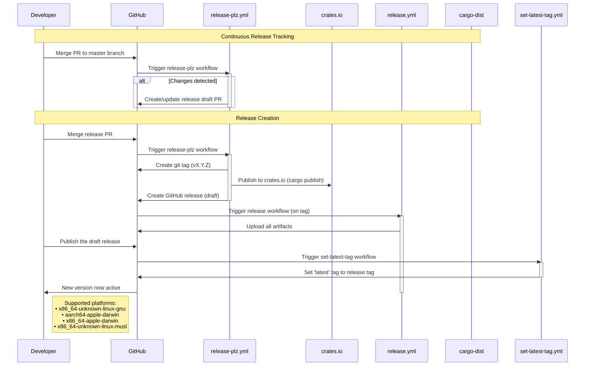

# Release Process

This document outlines the automated release process for the git-perf project. Our release workflow is fully automated using GitHub Actions, release-plz, and cargo-dist.

## Overview

The release process consists of two main phases:
1. **Continuous Release Tracking** - A continuously pending PR tracks changes for the next release
2. **Release Creation** - When ready, the PR is merged, triggering automated artifact building and release creation

## Release Process Flow

## Key Components

- **release-plz.yml**: Runs on master branch pushes, creates draft release PRs, and for merged release PRs: generates tags, publishes to crates.io, and creates draft GitHub releases.
- **release.yml**: Uses cargo-dist and runs on tag creation, builds artifacts using cargo-dist, and uploads artifacts to GitHub releases.
- **set-latest-tag.yml**: Runs when a release is published from draft mode, sets the 'latest' tag to point to the published release tag.

## Tools and Configuration

- **release-plz**: Version management, changelog generation, crates.io publishing (`.release-plz.toml`)
- **cargo-dist**: Artifact building and distribution (`dist-workspace.toml`)

## Environment Variables and Secrets

The following secrets must be configured in GitHub repository settings:

- **APP_ID** and **APP_PRIVATE_KEY**: GitHub App credentials for release-plz to create PRs and tags that trigger workflows
- **CARGO_REGISTRY_TOKEN**: API token for publishing to crates.io (automatically used by release-plz)

## Additional Resources

- [release-plz Documentation](https://release-plz.ieni.dev/)
- [cargo-dist Documentation](https://opensource.axo.dev/cargo-dist/)
- [Conventional Commits](https://www.conventionalcommits.org/)
