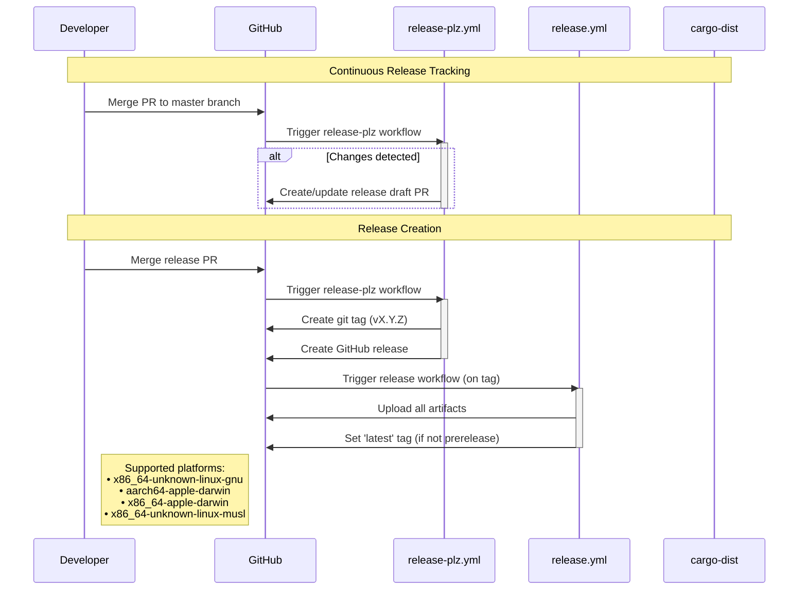

# Release Process

This document outlines the automated release process for the git-perf project. Our release workflow is fully automated using GitHub Actions, release-plz, and cargo-dist.

## Overview

The release process consists of two main phases:
1. **Continuous Release Tracking** - A continuously pending PR tracks changes for the next release
2. **Release Creation** - When ready, the PR is merged, triggering automated artifact building and release creation

## Release Process Flow

## Key Components

- **release-plz.yml**: Runs on master branch pushes, creates draft release PRs, and generates tags and creates GitHub release for merged release PRs.
- **release.yml**: Uses cargo-dist and runs on tag creation, builds artifacts using cargo-dist, and publishes artifacts to GitHub releases.

## Tools and Configuration

- **release-plz**: Version management and changelog generation (`.release-plz.toml`)
- **cargo-dist**: Artifact building and distribution (`Cargo.toml` workspace metadata)

## Additional Resources

- [release-plz Documentation](https://github.com/MarcoIeni/release-plz)
- [cargo-dist Documentation](https://github.com/axodotdev/cargo-dist)
- [Conventional Commits](https://www.conventionalcommits.org/)
