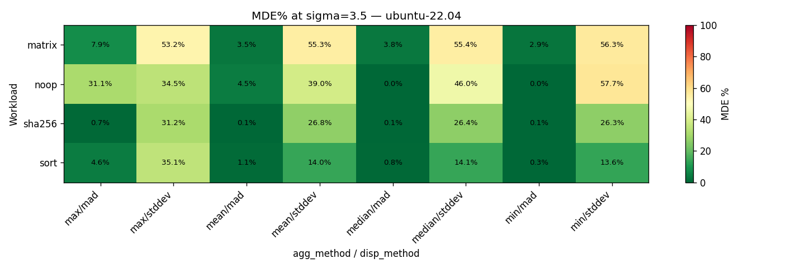
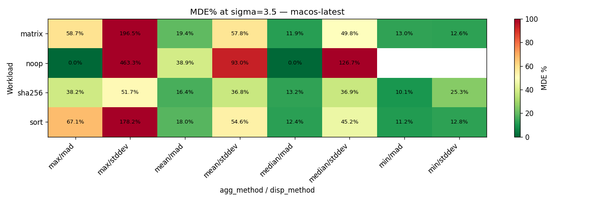
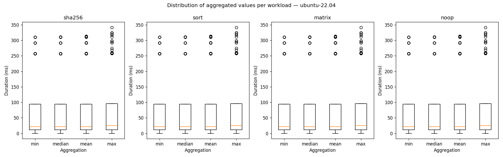
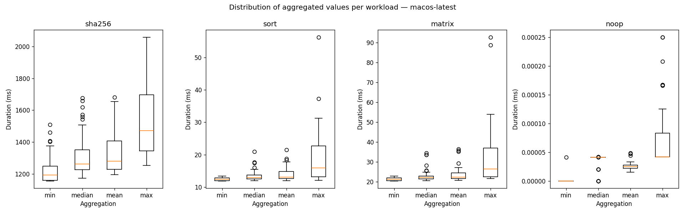
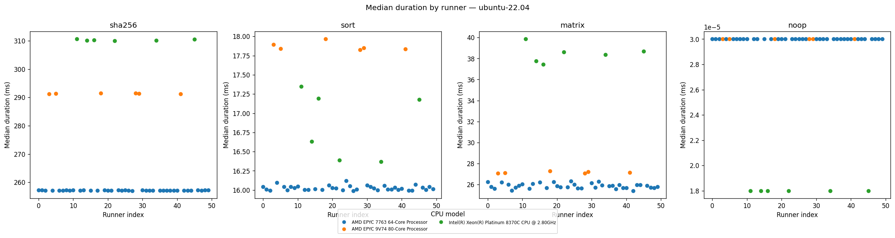
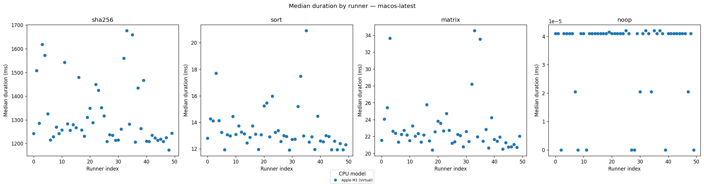
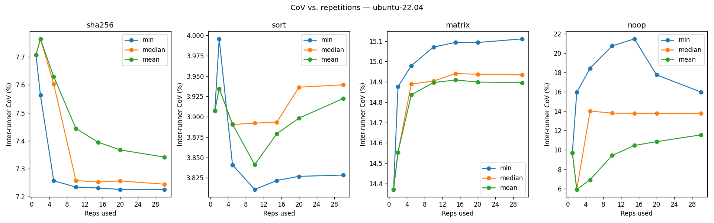
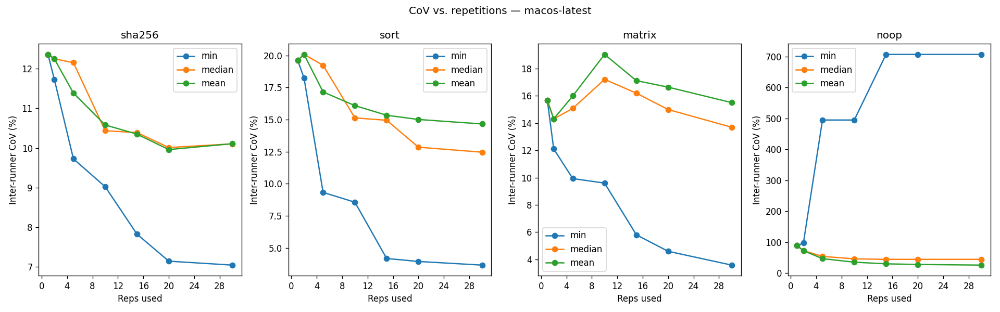

# Cross-Runner Variance Experiment on GitHub Actions

## Motivation

When git-perf detects performance regressions in CI, each commit is typically measured on a **different runner** from the shared pool. The noise floor for regression detection is therefore dominated by **inter-runner variance** -- how much benchmark results differ across machines, not within a single machine.

This experiment quantifies that variance on GitHub Actions shared runners to answer:

1. What is the inter-runner coefficient of variation (CoV) for realistic workloads?
2. Which aggregation method (min, median, mean, max) best reduces cross-runner noise?
3. Which dispersion method (stddev vs MAD) gives more useful minimum detectable effect (MDE)?
4. How many repetitions per runner are needed before inter-runner CoV stabilizes?

## Experiment Design

**50 runner instances per OS** (ubuntu-22.04 and macos-latest), accumulated over 5 workflow dispatches of 10 parallel jobs each.

Each runner:
1. Builds a standalone Rust benchmark binary
2. Captures runner metadata (CPU model, core count)
3. Runs 4 workloads x 30 repetitions each
4. Uploads a CSV artifact

### Workloads

| Workload | Description | Duration Target |
|----------|-------------|-----------------|
| **sha256** | 100K iterations of SHA-256 on 4KB blocks | ~1.2s |
| **sort** | Sort 1M deterministic random u64s | ~16ms |
| **matrix** | 512x512 f64 matrix multiply | ~25ms |
| **noop** | `black_box(())` | ~nanoseconds |

The `noop` workload exists to measure pure timing overhead and is expected to be useless for real benchmarking.

## Results

### Verdict: Inter-Runner Feasibility

| OS | Workload | Best CoV (%) | Best Aggregation | Verdict |
|---|---|---|---|---|
| macOS | sha256 | 7.04% | min | GREEN (<10%) |
| macOS | sort | 3.65% | min | GREEN |
| macOS | matrix | 3.58% | min | GREEN |
| macOS | noop | 25.47% | mean | RED (>20%) |
| Ubuntu | sha256 | 7.23% | min | GREEN |
| Ubuntu | sort | 3.83% | min | GREEN |
| Ubuntu | matrix | 14.43% | max | YELLOW (10-20%) |
| Ubuntu | noop | 9.71% | max | GREEN |

**Thresholds**: GREEN < 10%, YELLOW 10-20%, RED > 20%.

### Inter-Runner CoV by Aggregation Method

#### macOS

| Workload | min | median | mean | max |
|---|---|---|---|---|
| sha256 | 7.04% | 10.10% | 10.11% | 14.25% |
| sort | 3.65% | 12.46% | 14.67% | 43.17% |
| matrix | 3.58% | 13.69% | 15.50% | 46.37% |
| noop | 707.11% | 44.03% | 25.47% | 76.43% |

#### Ubuntu

| Workload | min | median | mean | max |
|---|---|---|---|---|
| sha256 | 7.23% | 7.25% | 7.34% | 8.51% |
| sort | 3.83% | 3.94% | 3.92% | 9.64% |
| matrix | 15.11% | 14.93% | 14.90% | 14.43% |
| noop | 15.99% | 13.79% | 11.56% | 9.71% |

### Within-Runner CoV

This measures how much a single runner's 30 reps vary (the intra-machine noise).

| OS | Workload | Median CoV (%) | IQR |
|---|---|---|---|
| Ubuntu | sha256 | 0.08% | [0.07%, 0.17%] |
| Ubuntu | sort | 0.39% | [0.28%, 0.73%] |
| Ubuntu | matrix | 0.79% | [0.45%, 1.25%] |
| Ubuntu | noop | 38.32% | [36.92%, 39.85%] |
| macOS | sha256 | 5.08% | [3.59%, 6.93%] |
| macOS | sort | 5.32% | [2.00%, 14.80%] |
| macOS | matrix | 4.61% | [2.28%, 15.20%] |
| macOS | noop | 88.95% | [76.62%, 95.25%] |

### MDE Heatmaps (sigma=3.5)

The Minimum Detectable Effect is computed as `sigma * dispersion / center * 100%`. Lower is better -- it means git-perf can detect smaller regressions.

**Ubuntu:**



**macOS:**



### Box Plots: Distribution of Aggregated Values

**Ubuntu:**



**macOS:**



### Scatter Plots by Runner (Median Aggregation)

These reveal hardware heterogeneity. Each color is a different CPU model.

**Ubuntu:**



**macOS:**



### CoV vs. Repetitions

Shows how inter-runner CoV changes as more reps are used per runner.

**Ubuntu:**



**macOS:**



## Key Findings

### 1. `min` aggregation is the best choice for CI

On macOS, using `min` instead of `median` cuts inter-runner CoV by 2-4x (e.g., sort: 3.65% vs 12.46%). The `min` of N repetitions captures the uncontested best-case run, stripping out OS scheduling and noisy-neighbor effects. On Ubuntu the advantage is smaller but still present.

**Recommendation**: Use `aggregate_by = "min"` in `.gitperfconfig`.

### 2. MAD dramatically outperforms stddev for MDE

With MAD as the dispersion method, the MDE at sigma=3.5 on Ubuntu is sub-1% for sha256 and sort (min/mad: 0.1%). With stddev, MDE balloons to 25-56% because a single outlier runner inflates the standard deviation.

**Recommendation**: Use `dispersion_method = "mad"` in `.gitperfconfig`.

### 3. Ubuntu runners have hardware heterogeneity

The scatter plots show 3 distinct CPU clusters on Ubuntu:
- **AMD EPYC 7763** (majority): ~258ms sha256
- **AMD EPYC 9V74**: ~293ms sha256
- **Intel Xeon 8370C** (rare): ~310ms sha256

This hardware mix is the dominant source of inter-runner variance on Ubuntu. The `min` aggregation partially mitigates this because faster hardware gives lower minimums, but the 20% gap between CPU types sets a hard floor on CoV.

### 4. macOS runners are noisy but homogeneous

All macOS runners report "Apple M1 (Virtual)" with 3 vCPUs. Despite hardware homogeneity, within-runner CoV is ~5% (vs <1% on Ubuntu), likely due to macOS virtualization overhead and scheduling variability. The good news: `min` aggregation effectively cuts through this noise.

### 5. More reps help on macOS, plateau quickly on Ubuntu

On macOS, inter-runner CoV (with `min`) drops from ~12% at 1 rep to ~7% at 30 reps. The curve flattens around 15-20 reps. On Ubuntu, CoV is already near its floor at 5 reps.

**Recommendation**: Use at least 15 repetitions for macOS runners, 5-10 for Ubuntu.

### 6. Sub-millisecond workloads are useless

The `noop` workload (sub-microsecond) is dominated by timing overhead. Its CoV is 700%+ on macOS with `min`. Real benchmarks should target at least ~10ms duration.

## Practical Recommendations for git-perf Users

Based on this experiment, the recommended `.gitperfconfig` for CI environments:

```toml
[measurement]
aggregate_by = "min"
dispersion_method = "mad"
sigma = 3.5
min_measurements = 10
```

With this configuration and the observed noise levels:

| OS | Workload Type | Expected MDE |
|---|---|---|
| Ubuntu | CPU-bound (~1s) | ~0.1% (excellent) |
| Ubuntu | Memory-bound (~16ms) | ~0.3-1% (excellent) |
| macOS | CPU-bound (~1s) | ~10% (moderate) |
| macOS | Memory-bound (~16ms) | ~11-13% (moderate) |

**Translation**: On Ubuntu runners, git-perf can reliably detect regressions as small as 1%. On macOS runners, expect to detect regressions of ~10% or larger.

## Reproducing the Experiment

### Prerequisites

- A GitHub repository with Actions enabled
- `uv` (for the analysis script): `curl -LsSf https://astral.sh/uv/install.sh | sh`

### Step 1: Add the Experiment Files

The experiment lives in two places in this repository:
- `variance-experiment/` -- standalone Rust benchmark binary
- `.github/workflows/cross-runner-variance.yml` -- GitHub Actions workflow

### Step 2: Run the Workflow

The workflow uses `workflow_dispatch`, so it must exist on the default branch.

```bash
# Trigger 5 runs (10 instances each = 50 runners per OS)
for i in $(seq 1 5); do
  gh workflow run cross-runner-variance.yml
  sleep 5
done
```

### Step 3: Download Results

```bash
# List completed runs
gh run list --workflow cross-runner-variance.yml

# Download all artifacts
mkdir -p all-results
for run_id in $(gh run list --workflow cross-runner-variance.yml --json databaseId --jq '.[].databaseId'); do
  gh run download "$run_id" --pattern "results-*" --dir all-results/
done
```

### Step 4: Run the Analysis

```bash
uv run scripts/analyze-variance.py all-results/ analysis-output/
```

This produces:
- `analysis-output/verdict.md` -- feasibility verdict per workload
- `analysis-output/summary_inter_runner_cov.md` -- CoV breakdown by aggregation method
- `analysis-output/within_runner_cov.md` -- intra-runner noise
- `analysis-output/mde_heatmap_*.png` -- MDE at sigma=3.5
- `analysis-output/boxplots_*.png` -- distribution of aggregated values
- `analysis-output/scatter_by_runner_*.png` -- hardware stratification
- `analysis-output/cov_vs_reps_*.png` -- CoV convergence curve

## Raw Data

The raw CSV files contain one row per (runner, workload, repetition) with columns:
```
runner_id,cpu_model,cpu_count,os,run_number,instance,workload,rep_index,duration_ns
```

12,000 rows total across 100 runners, 4 workloads, and 30 reps each.
